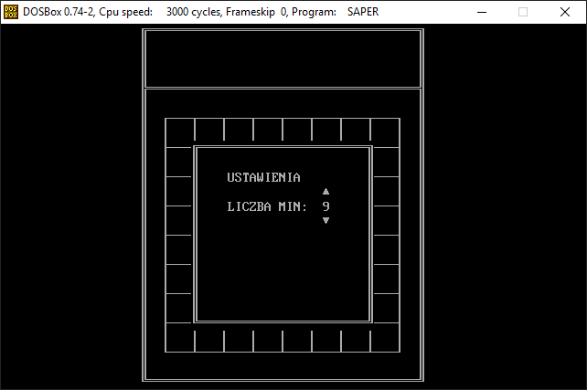

# Saper

## Introduction
In 2011, I was in the second grade of high school and I created two games for subject *Structure and object programming* (Polish: *Programowanie strukturalne i obiektowe*): [Deska](https://gitlab.com/adam-zielonka-pro/pascal-games/deska) and [Saper](https://gitlab.com/adam-zielonka-pro/pascal-games/saper). In these lessons, we learned to program using the Pascal language.

## About this game
This game was created in May 2011. The rules is simlar to game called *Minesweeper* (Polish: *Saper*) from Windows system.

## How to run this game?
You can go to this webiste: [Play](https://saper.adamzielonka.pro/), the game run via [js-dos](https://js-dos.com/)  
You can also download the game from this: [Download](https://saper.adamzielonka.pro/SAPER.ZIP), and run in [DOSBox](https://www.dosbox.com/).

The code was written using OEM 852 character set, so if you run this game by yourself, you should remeber to change default charset using this command:

```
KEYB pl
```

## Screens



